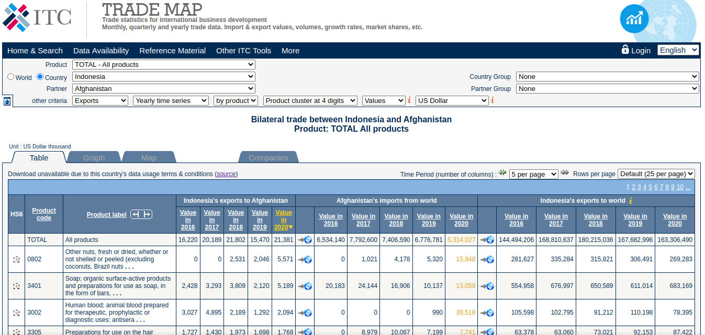
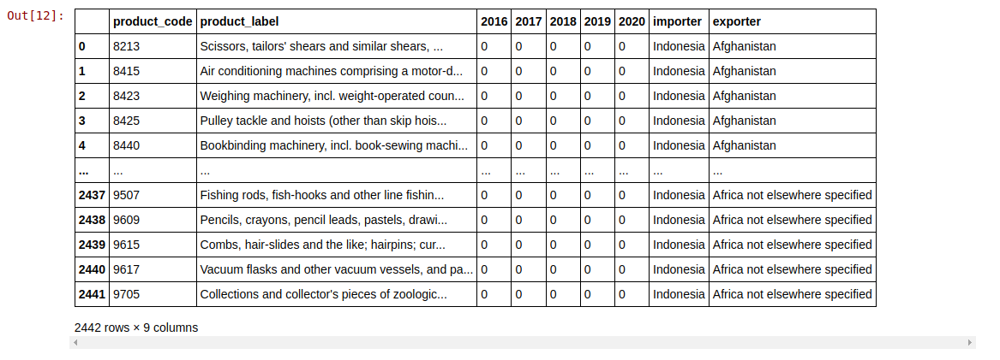

# Trademap  Bilateral Trade  Data Scraping v2

<p align="center">
  
</p>
 

## **Overview**
In this project, we create web scraper with Selenium and  BeautifulSoup using python.
 

 

 
 

## Project Files

```test.ipynb``` -> a jupyter notebook contains python code for testing  scraping in trademap.org website

```final_scraping.ipynb``` -> a jupyter notebook contains python code that final code for   scraping in trademap.org website

```output.xlsx``` -> output dataframe  that convert into excel file. 

```output.csv``` -> output dataframe  that convert into csv file. 
 

## Environment 
Python 3.6 or above

Selenium   
BeautifulSoup  


## How to run

open  the jupyter notebook ```final_scraping.ipynb``` as below.

```
final_scraping.ipynb
``` 


## Output 

<p align="center">
  
</p>
 